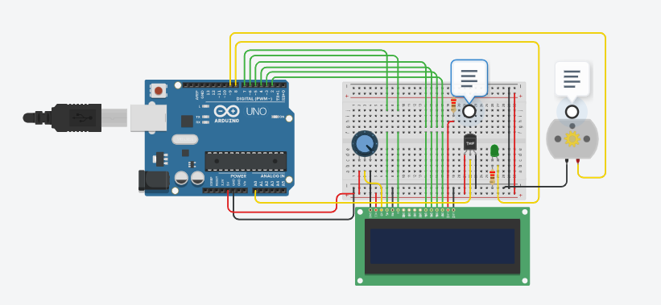

# Repositorio-para-avalia-o

<b><h3>Repositório para Avaliação</h3></b>

<b><h3>  <ul>
<li> Projeto - Sistema de temperatura:</ul> </h3></b>
 
 
 

 
<a href = "reposit_rio_para_avalia_o_sensor_de_temperatura1.ino"> Clique aqui para acessar o código</a>
  

<b>Tinkercad:</b>

Confira no Tinkercad <a href="https://www.tinkercad.com/things/iwm72tNDTgn-atividade-avaliacao-sensor-de-temperatura/editel?sharecode=P9Ww8AX0dAt2UR-tVdPyi5m0ntXfwZrZE-5V5mucG20" target="_blank">Clique aqui</a>.

 

